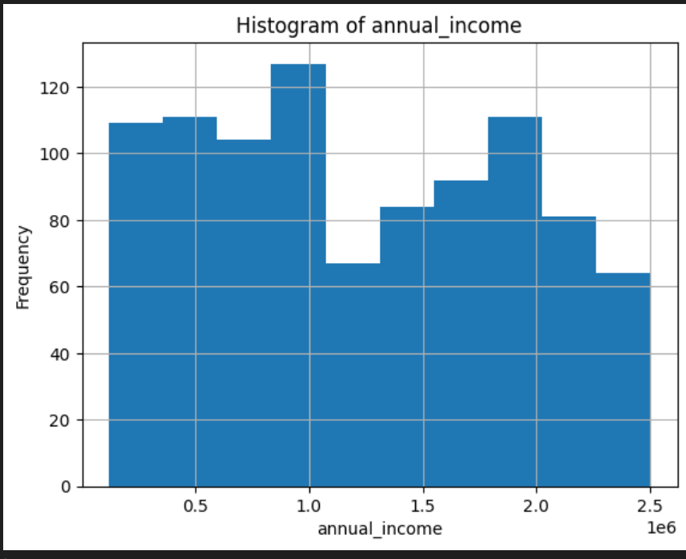
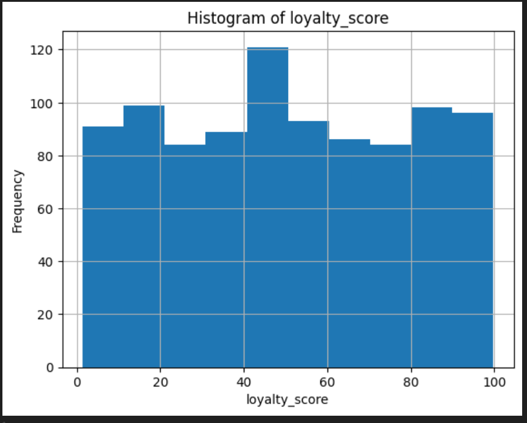
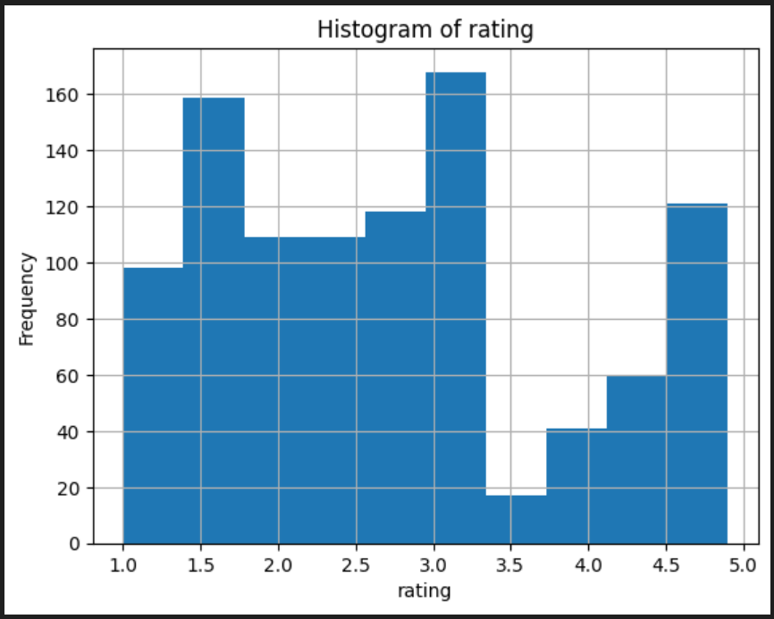
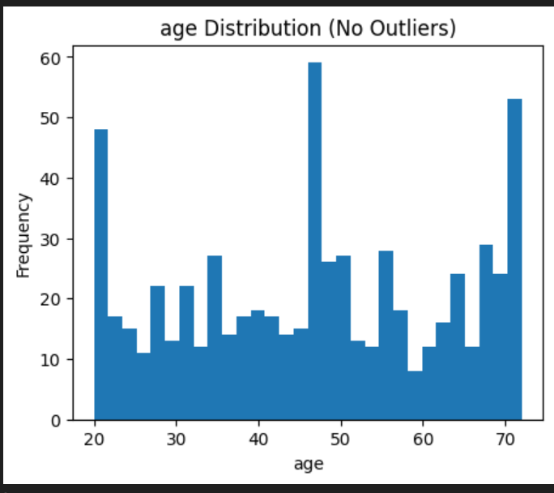
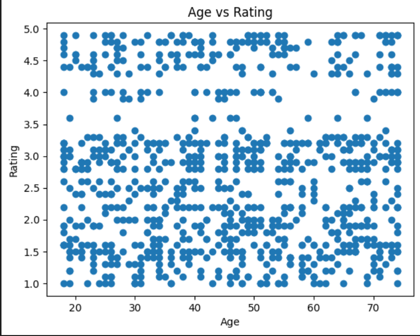
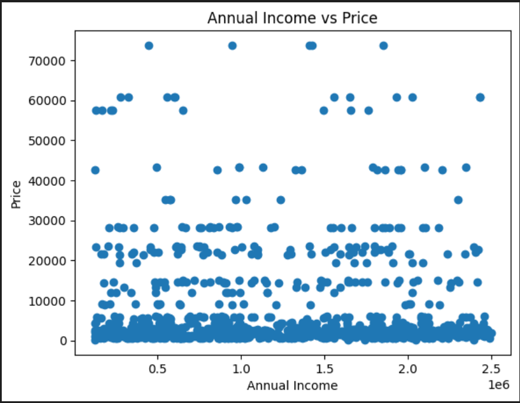
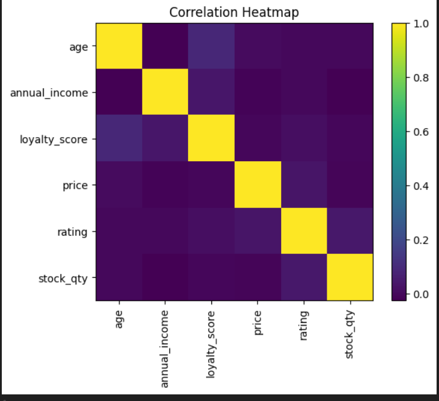
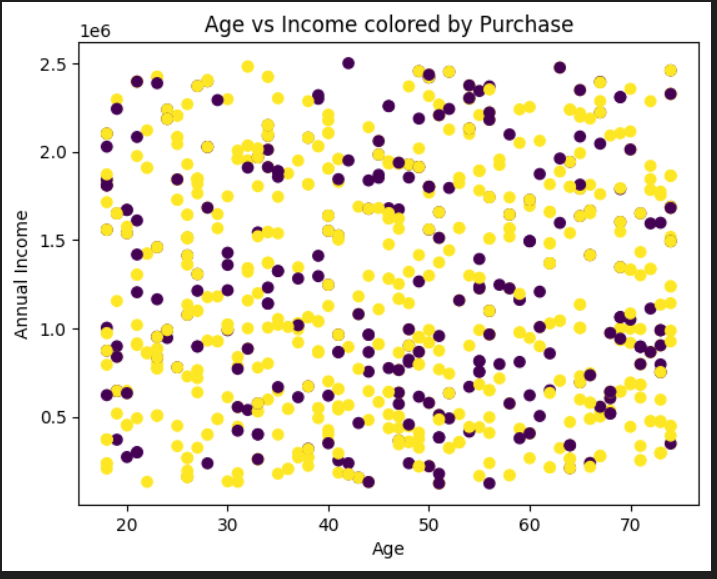

## 📊 Exploratory Data Analysis (EDA) – Visual Results

This folder contains all visualizations generated during data preprocessing and feature engineering.
The graphs illustrate data behavior before and after missing value treatment, helping to validate preprocessing decisions.

Each section is organized step-by-step, following standard data science EDA workflows.

--------------------------------

## 🔹 Univariate Analysis (Before Filling Missing Values)

📂 Folder: Before_filling_univariate_analysis

This section shows the distribution of individual variables before handling missing values.

--------------------------------

## 📌 Purpose

Identify missing values

Detect skewness

Spot extreme outliers

--------------------------------

## 📊 Visuals Included

Histograms

Boxplots

--------------------------------

## 🖼️ Graphs

These plots show the data condition **before handling missing values**.

### annual_income (Before Filling)

### loyalty_score (Before Filling)

### price (Before Filling)

### rating (Before Filling)

---

## 🔹 Univariate Analysis (After Filling Missing Values)

📂 Folder: after_filling_univariate_analysis

These graphs demonstrate how distributions improve after imputation.

--------------------------------

## 📌 Purpose

Validate imputation strategy

Ensure stable distributions

--------------------------------

## 📊 Visuals Included

Histograms

Boxplots

--------------------------------

## 🖼️ Graphs

These plots show the data condition **after handling missing values**.

### annual_income (after Filling)

### loyalty_score (after Filling)

### price (after Filling)

### rating (after Filling)

### age (after Filling)

--------------------------------

## 🔹 Bivariate Analysis (Before Filling)

📂 Folder: before_filling_bivariate_analysis

Shows relationships between two variables before preprocessing.

--------------------------------

## 📌 Purpose

Identify missing-value impact

Observe raw correlations

--------------------------------

## 📊 Visuals Included

Scatter plots

Group comparisons

--------------------------------

## 🖼️ Graphs

Bivariate analysis shows **relationships between two variables**.

### age vs ratings

### annual_income vs purchased

### annual_income vs price

--------------------------------

## 🔹 Bivariate Analysis (After Filling)

📂 Folder: bivariate_analysis_after_filling

Demonstrates cleaner and more meaningful relationships after preprocessing.

--------------------------------
 
## 📌 Purpose

Validate missing value treatment

Improve interpretability

--------------------------------

## 📊 Visuals Included

Scatter plots

Category vs numerical plots

--------------------------------

## 🖼️ Graphs

--------------------------------

## 🔹 Multivariate Analysis (Before Filling)

📂 Folder: before_filling_multivariate_analysis

Shows complex relationships between multiple variables before cleaning.

--------------------------------

## 📌 Purpose

Detect noise

Identify correlation distortion

--------------------------------

## 📊 Visuals Included

Correlation heatmaps

Multi-feature plots

--------------------------------

## 🖼️ Graphs

multivariate analysis shows **relationships between two and more than variables**.

### Heatmap

### annual_income vs purchased vs age

### price vs category vs purchased

--------------------------------

## 🔹 Multivariate Analysis (After Filling)

📂 Folder: multivariate_analysis_after_filling

Final multivariate visualizations using cleaned and feature-engineered data.

--------------------------------

## 📌 Purpose

Confirm data readiness for ML

Validate feature relationships

--------------------------------

## 📊 Visuals Included

Correlation heatmaps

Feature interaction plots

--------------------------------
## 🖼️ Graphs

multivariate analysis shows **relationships between two and more than variables**.

### Heatmap

--------------------------------

## ✅ Key Insights from Visual Analysis

✔ Missing value treatment stabilized distributions

✔ Outliers were controlled effectively

✔ Feature relationships became clearer after preprocessing

✔ Data is now suitable for ML modeling
